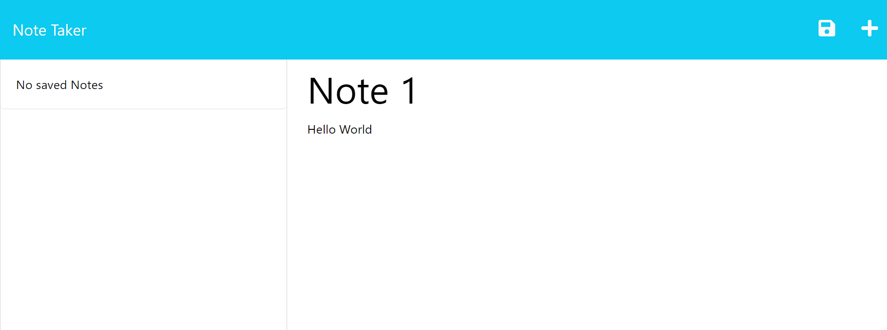

# NoteTaker
This is an express app for user to add notes with a text and a title.

<br>

## Table of Contents

- [Description](#description)
- [Usage](#usage)
- [References](#references)
- [Links](#links)
- [Features](#features)
- [User Story](#user-story)
- [Acceptance Criteria](#acceptance-criteria)

<br>

## Description

- This program will start on the homepage, user can click on "Get Started" to start taking notes
- Each note can have a title and a text, you can save your notes and delete your notes

<br>

## Usage




<br>

## Links

- Github page: https://github.com/teddysm/NoteTaker
- Heroku deployed link: https://nameless-brushlands-85998.herokuapp.com/


<br>

## Features

- When you start typing a note, a SAVE icon will appear. When you are done with your note you can hit save.
- You can also delete a note by clicking on the DELETE icon

<br>

## User Story

```
AS A small business owner
I WANT to be able to write and save notes
SO THAT I can organize my thoughts and keep track of tasks I need to complete
```


## Acceptance Criteria

```
GIVEN a note-taking application
WHEN I open the Note Taker
THEN I am presented with a landing page with a link to a notes page
WHEN I click on the link to the notes page
THEN I am presented with a page with existing notes listed in the left-hand column, plus empty fields to enter a new note title and the note’s text in the right-hand column
WHEN I enter a new note title and the note’s text
THEN a Save icon appears in the navigation at the top of the page
WHEN I click on the Save icon
THEN the new note I have entered is saved and appears in the left-hand column with the other existing notes
WHEN I click on an existing note in the list in the left-hand column
THEN that note appears in the right-hand column
WHEN I click on the Write icon in the navigation at the top of the page
THEN I am presented with empty fields to enter a new note title and the note’s text in the right-hand column
```